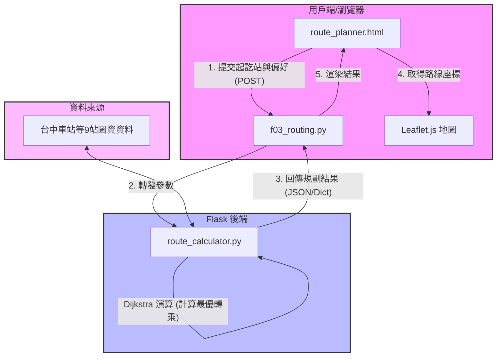

# 系統架構設計文件 (System Architecture)

本文件描述「台中大眾運輸交通整合APP」的技術架構設計，著重於如何實作多運具轉乘與地圖導覽的協作架構。

## 一、技術架構說明

本專案遵循課堂規範，採用單體式（Monolithic）架構，利用 **Flask** 實作 MVC（Model-View-Controller）模式，使前端與後端整合在同一個專案中：

- **Model (模型/服務層)**：
  - 負責資料邏輯與演算邏輯。
  - 由於 F-03 模組包含較複雜的跨運具轉乘演算法（Dijkstra），特別將演算法抽離至 `app/services/route_calculator.py` 作為獨立服務層，便於後續與 TDX API 數據整合與測試。
- **View (視圖層/前端)**：
  - 採用 **Jinja2** HTML 模板進行動態渲染，並結合 **Leaflet.js** 與 **Bootstrap 5** 來實作現代化的 UI。
- **Controller (控制器/路由層)**：
  - 由 `app/routes/` 裡的 Flask Blueprints 擔任，負責接收 HTTP 請求（如起終點參數、交通偏好），呼叫 Model/Services 層進行計算，並將結果傳遞給 View 層渲染輸出。

---

## 二、專案資料夾結構

以下為目前已建立的專案資料夾結構與各檔案的用途說明：

```
create-app/
├── .agents/                 # AI Agent 技能配置與說明
├── docs/                    # SDLC 設計文件夾
│   ├── PRD.md               # 產品需求文件 (Phase 1)
│   └── ARCHITECTURE.md      # 系統架構文件 (Phase 2 - 本文件)
├── app/                     # Flask 應用程式主目錄
│   ├── __init__.py          # 應用程式工廠 (Factory Pattern) 初始化
│   ├── routes/              # 控制器層 (Routes / Blueprints)
│   │   └── f03_routing.py   # F-03 轉乘規劃路由控制
│   ├── services/            # 服務與演算邏輯層 (Business Logic)
│   │   └── route_calculator.py # Dijkstra 多運具轉乘演算法與圖資
│   └── templates/           # 視圖層 (Jinja2 HTML 模板)
│       ├── base.html        # 全站共用 Layout 模板
│       └── f03/             # F-03 模組專屬模板資料夾
│           └── route_planner.html # 轉乘規劃首頁與地圖頁
├── .gitignore               # Git 忽略設定檔
├── app.py                   # 專案啟動入口點
├── requirements.txt         # 專案相依 Python 套件清單
└── 第12組_期末專題主題報告.md  # 專題主題與分工報告
```

---

## 三、元件關係圖



---

## 四、關鍵設計決策

1. **服務與路由分立（Controller & Service Separation）**：
   - 將 Dijkstra 轉乘演算法單獨實作於 `app/services/`，而非直接寫在 `f03_routing.py` 中。這樣可讓路由邏輯保持乾淨（僅負責參數檢驗與模板傳送），也利於後續進行獨立的單元測試與 API 擴充。
2. **靜態網格圖資（Static Graph Network）**：
   - F-03 最核心功能是展示多運具「轉乘組合」路徑演算。我們在服務層預建了台中精華地標（台中車站、逢甲大學、高鐵站等）的雙向連結網格（Graph），並為每個路段預設了捷運、公車、YouBike 與火車的平均時間與票價，以在無網際網路或 TDX 延遲時仍能保證演算法秒級回傳。
3. **無縫地圖資料交換（Jinja to JS JSON Serialization）**：
   - 透過 Jinja2 的 `tojson` 渲染器，在後端計算完路徑結果後，將結構化座標點與各路段運具資訊無縫傳遞給前端 JS。前端 Leaflet.js 可以直接遍歷該 JSON 來在正確的 GPS 點上渲染客製化 Icon 並畫出對應顏色的線段，降低了前後端資料串接的門檻。
