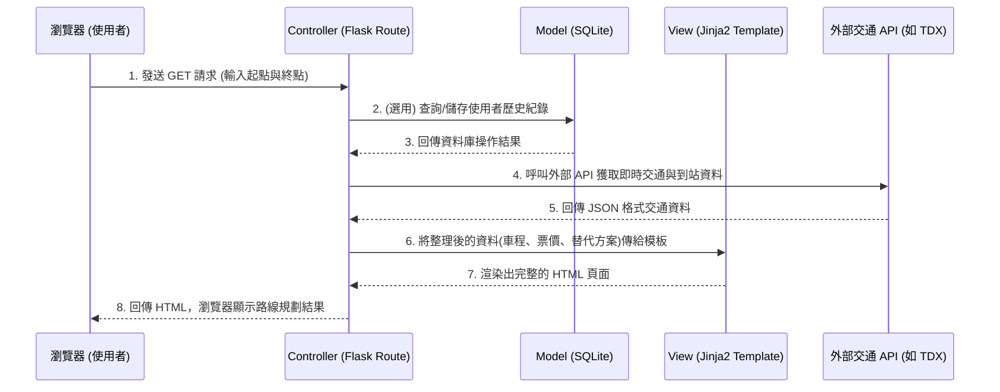

# 系統架構設計 (Architecture) - 台中大眾運輸交通整合APP系統

## 1. 技術架構說明

本專案採用經典的伺服器端渲染 (Server-Side Rendering, SSR) 網頁架構，未使用複雜的前後端分離框架，以降低初期開發門檻並加速 MVP 的產出。

### 選用技術與原因
- **後端框架 - Python + Flask**：輕量級的微框架，適合快速建立 API 與路由，學習曲線較平緩，彈性極高。
- **模板引擎 - Jinja2**：內建於 Flask 中，可以直接在 HTML 檔案裡嵌入 Python 變數與邏輯（如迴圈、條件判斷），快速實現動態資料渲染。
- **資料庫 - SQLite**：輕量型的關聯式資料庫，無需安裝額外的資料庫伺服器，資料儲存在單一檔案內，非常適合初期開發與中小型應用。

### Flask MVC 模式說明
雖然 Flask 本身不強制規定架構，但我們採用類似 **MVC (Model-View-Controller)** 的模式來組織程式碼：
- **Model (資料模型)**：負責與 SQLite 資料庫溝通，定義資料表結構（例如：用戶資訊、搜尋紀錄、常用路線），執行新增、查詢、修改、刪除等操作。
- **View (視圖)**：由 Jinja2 模板 (HTML) 與靜態資源 (CSS/JS) 組成，負責將資料視覺化並呈現給使用者，也就是前端介面。
- **Controller (控制器)**：在 Flask 中主要由 `routes` (路由) 負責。負責接收使用者的 HTTP 請求、調用 Model 取得資料、經過商業邏輯處理後，將結果傳遞給 View 進行畫面渲染。

---

## 2. 專案資料夾結構

為了讓程式碼好維護、易於擴充，我們將專案切分為以下結構：

```text
create-app/
├── app/                      ← 專案主程式目錄
│   ├── __init__.py           ← Flask 應用程式工廠設定（App Factory）
│   ├── models/               ← 【Model】資料庫存取層
│   │   ├── __init__.py
│   │   ├── user.py           ← 用戶資料庫模型
│   │   └── route_history.py  ← 搜尋/常用路線紀錄模型
│   ├── routes/               ← 【Controller】API 與頁面路由
│   │   ├── __init__.py
│   │   ├── main.py           ← 首頁與基礎頁面
│   │   └── transit.py        ← 交通路線規劃、到站時間查詢等核心邏輯
│   ├── templates/            ← 【View】Jinja2 HTML 模板
│   │   ├── base.html         ← 共同版型（共用標頭、導覽列、頁尾）
│   │   ├── index.html        ← 首頁
│   │   ├── map.html          ← 大眾運輸檢視圖頁面
│   │   └── result.html       ← 路線規劃與時間預估結果頁面
│   └── static/               ← 前端靜態資源
│       ├── css/
│       │   └── style.css     ← 自訂樣式表
│       ├── js/
│       │   └── main.js       ← 前端互動邏輯（如定位功能呼叫）
│       └── images/           ← 圖片資源
├── instance/                 ← 放置不進版控的執行實例檔案
│   └── database.db           ← SQLite 實體資料庫檔案
├── docs/                     ← 文件存放區
│   ├── PRD.md                ← 產品需求文件
│   └── ARCHITECTURE.md       ← 系統架構文件 (本文件)
├── requirements.txt          ← 記錄專案所需的 Python 套件清單
└── app.py                    ← 啟動 Flask 應用程式的入口檔案
```

---

## 3. 元件關係圖

以下圖示展示了當使用者開啟網頁並進行「路線查詢」時，系統內部的運作流程：



---

## 4. 關鍵設計決策

1. **採用伺服器端渲染 (Jinja2)**
   - **原因**：考量到團隊對前後端分離的熟悉度與開發時程，使用 Jinja2 可以在一個專案內同時搞定前後端。這對於需要快速做出 MVP（最簡可行產品）來說是最有效率的選擇。
   
2. **外部 API 即時呼叫與快取策略 (Controller 層次處理)**
   - **原因**：「準確的到站時間」是本系統的核心價值，因此交通數據必須呼叫政府或官方的公開 API (如 TDX 運輸資料流通服務)。為了避免超過 API 呼叫次數限制與提升回應速度，Controller 在呼叫外部 API 時，需要設計適當的快取機制。
   
3. **前端定位功能與後端整合**
   - **原因**：瀏覽器的 `Geolocation API` 必須在前端 JavaScript 中執行。因此設計為：當使用者開啟網頁時，由前端 JS 取得經緯度，再透過 URL 參數或表單方式傳給 Flask 後端，後端再以此座標進行附近站點與路線的計算。
   
4. **模組化的路由設計 (Blueprints)**
   - **原因**：為了避免所有的路由都擠在 `app.py` 中難以維護，我們採用 Flask Blueprint 將路由拆分到 `routes/` 資料夾下（如 `main.py` 與 `transit.py`）。這能讓程式碼職責分離，方便未來的擴充與維護。
