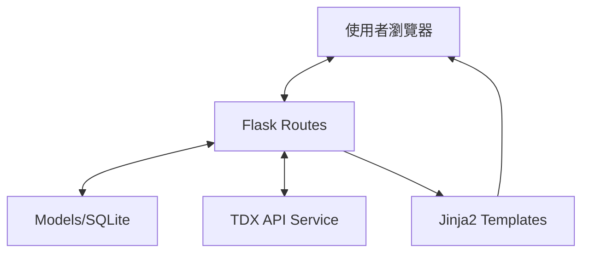

# 系統架構文件 (ARCHITECTURE)

## 1. 技術架構說明
本專案採用 **Flask MVC** 模式，由 Flask 負責路由分發與邏輯處理，Jinja2 負責前端頁面渲染，SQLite 作為資料存儲。

- **後端**: Python + Flask (輕量、易於擴展)
- **前端**: HTML / Vanilla CSS / JavaScript (Leaflet.js 用於地圖展示)
- **資料庫**: SQLite (適合中小型專題，無需額外安裝伺服器)
- **API 來源**: TDX (Transport Data eXchange) 提供交通即時數據

## 2. 專案資料夾結構
```
create-app/
├── app/
│   ├── models/          # 資料庫模型與資料存取邏輯
│   ├── routes/          # Flask 路由 (Controllers)
│   ├── static/          # 靜態資源 (CSS, JS, 圖片)
│   │   ├── css/
│   │   └── js/
│   └── templates/       # Jinja2 HTML 模板 (Views)
├── docs/                # 專案文件 (PRD, Architecture 等)
├── instance/            # 實例資料夾 (放置 SQLite 資料庫)
├── utils/               # 工具函式 (例如 TDX API 串接工具)
├── app.py               # 應用程式入口
├── requirements.txt     # 相依套件清單
└── 開發步驟.md          # 原始專案規劃
```

## 3. 元件關係圖


## 4. 關鍵設計決策
1. **地圖聯動機制**: 點擊 Leaflet.js 標記點後，觸發 JavaScript 事件非同步請求後端數據，並更新側邊欄 DOM。
2. **即時數據更新**: 前端 JS 定期 (例如每 30 秒) 透過 Fetch API 請求最新車輛位置與到站時間。
3. **資料緩存**: 針對靜態不常變動的站點資訊，考慮存儲於本地 SQLite 或內存緩存，以減少 API 請求次數。
