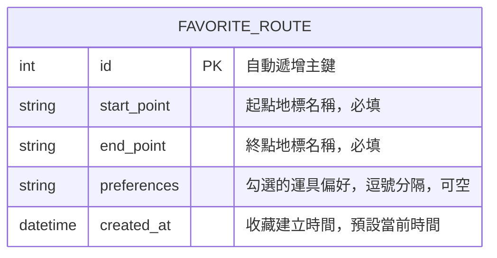

# 資料庫設計文件 (Database Design)

本文件描述「台中大眾運輸交通整合APP」F-03 轉乘規劃模組與未來 F-05 個人化收藏管理整合的資料庫設計。

## 一、ER 圖 (Entity Relationship Diagram)

本模組使用一個關聯表來記錄使用者收藏的最佳路線組合：



---

## 二、資料表詳細說明

### 2.1 常用路線收藏表 (`favorite_routes`)

- **用途**：儲存使用者收藏的起迄路線與偏好運具，以供首頁或收藏夾快速調用。
- **欄位設計**：

| 欄位名稱 | 資料型別 | 主鍵/外鍵 | 必填 | 預設值 | 說明 |
| --- | --- | --- | --- | --- | --- |
| `id` | INTEGER | PK | 是 | - | 自動遞增唯一識別碼 |
| `start_point` | TEXT | - | 是 | - | 起點站名稱 (例如：台中車站) |
| `end_point` | TEXT | - | 是 | - | 終點站名稱 (例如：逢甲大學) |
| `preferences` | TEXT | - | 否 | NULL | 以逗號分隔的交通工具代號 (例如：mrt,bus,youbike) |
| `created_at` | DATETIME | - | 是 | CURRENT_TIMESTAMP | 收藏儲存的時間戳記 |

---

## 三、SQL 建表語法

建表語法儲存於 `database/schema.sql`：

```sql
-- 建立常用路線收藏表
CREATE TABLE IF NOT EXISTS favorite_routes (
    id INTEGER PRIMARY KEY AUTOINCREMENT,
    start_point TEXT NOT NULL,
    end_point TEXT NOT NULL,
    preferences TEXT,
    created_at DATETIME DEFAULT CURRENT_TIMESTAMP
);
```

---

## 四、Python Model 說明

為配合 Flask 架構，實作模型位於 `app/models/favorite_route.py`。
該模型使用 Python 內建的 `sqlite3` 庫實作對資料庫的 CRUD 動作，不需要額外安裝 ORM 套件，輕量且符合初學者開發規範。
