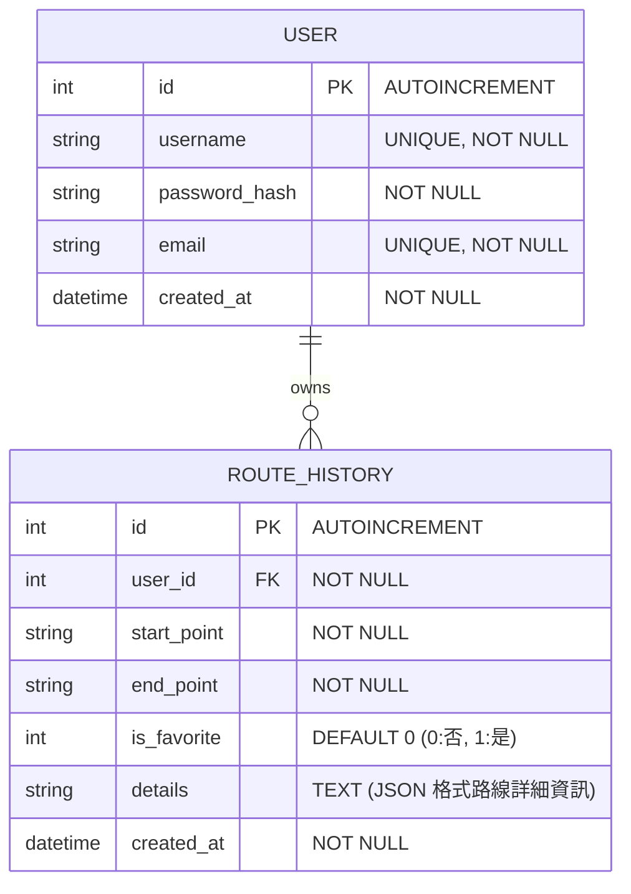

# 資料庫設計文件 (DB Design) - 台中大眾運輸交通整合APP系統

本文件依據 [PRD.md](file:///c:/Users/User/Desktop/create-app/docs/PRD.md) 與 [FLOWCHART.md](file:///c:/Users/User/Desktop/create-app/docs/FLOWCHART.md) 的需求，規劃 SQLite 資料庫架構，並定義資料表之間的關聯。

---

## 1. 實體關係圖 (ER Diagram)

我們使用 Mermaid `erDiagram` 語法來展示資料表結構與其關聯。系統主要包含 `user` (使用者) 與 `route_history` (搜尋/常用路線紀錄) 兩個實體，兩者為**一對多 (1:N)** 關係：一名使用者可以擁有多筆搜尋與最愛路線紀錄；當使用者帳號被刪除時，其相關紀錄也將一併刪除。



---

## 2. 資料表詳細說明

### 2.1 使用者資料表 (`user`)
用於儲存系統使用者的帳密與基本資訊。

| 欄位名稱 | 資料型別 | 鍵/約束 | 必填 | 預設值 | 說明 |
| :--- | :--- | :--- | :--- | :--- | :--- |
| `id` | INTEGER | PRIMARY KEY | Yes | AUTOINCREMENT | 使用者唯一識別碼 |
| `username` | TEXT | UNIQUE | Yes | - | 使用者帳號，登入憑證 |
| `password_hash` | TEXT | - | Yes | - | 加密後的密碼雜湊值（不存明文） |
| `email` | TEXT | UNIQUE | Yes | - | 電子郵件信箱 |
| `created_at` | TEXT | - | Yes | CURRENT_TIMESTAMP | 帳號建立時間（ISO 8601 格式） |

### 2.2 路線歷史與最愛資料表 (`route_history`)
儲存使用者每次進行起訖點搜尋的紀錄，以及使用者標記為「常用路線」的收藏。

| 欄位名稱 | 資料型別 | 鍵/約束 | 必填 | 預設值 | 說明 |
| :--- | :--- | :--- | :--- | :--- | :--- |
| `id` | INTEGER | PRIMARY KEY | Yes | AUTOINCREMENT | 紀錄唯一識別碼 |
| `user_id` | INTEGER | FOREIGN KEY | Yes | - | 關聯至 `user.id`，啟用 `ON DELETE CASCADE` |
| `start_point` | TEXT | - | Yes | - | 路線起點名稱或經緯度座標 |
| `end_point` | TEXT | - | Yes | - | 路線終點名稱或經緯度座標 |
| `is_favorite` | INTEGER | CHECK(0 or 1) | Yes | 0 | 是否為常用/收藏路線（0 = 否, 1 = 是） |
| `details` | TEXT | JSON | No | - | 儲存推薦路線、車資、替代方案及各段時間的 JSON 字串 |
| `created_at` | TEXT | - | Yes | CURRENT_TIMESTAMP | 搜尋或建立收藏的時間（ISO 8601 格式） |

---

## 3. SQL 建表語法

完整的建表腳本儲存在 [schema.sql](file:///c:/Users/User/Desktop/create-app/database/schema.sql)。

### SQLite 建表腳本預覽：
```sql
-- 啟用外鍵約束
PRAGMA foreign_keys = ON;

-- 建立使用者資料表
CREATE TABLE IF NOT EXISTS user (
    id INTEGER PRIMARY KEY AUTOINCREMENT,
    username TEXT UNIQUE NOT NULL,
    password_hash TEXT NOT NULL,
    email TEXT UNIQUE NOT NULL,
    created_at TEXT NOT NULL DEFAULT (datetime('now', 'localtime'))
);

-- 建立路線歷史與最愛資料表
CREATE TABLE IF NOT EXISTS route_history (
    id INTEGER PRIMARY KEY AUTOINCREMENT,
    user_id INTEGER NOT NULL,
    start_point TEXT NOT NULL,
    end_point TEXT NOT NULL,
    is_favorite INTEGER NOT NULL DEFAULT 0 CHECK(is_favorite IN (0, 1)),
    details TEXT, -- JSON text
    created_at TEXT NOT NULL DEFAULT (datetime('now', 'localtime')),
    FOREIGN KEY (user_id) REFERENCES user(id) ON DELETE CASCADE
);

-- 建立索引以優化查詢效能
CREATE INDEX IF NOT EXISTS idx_route_history_user_id ON route_history(user_id);
CREATE INDEX IF NOT EXISTS idx_route_history_favorite ON route_history(user_id, is_favorite);
```

---

## 4. Python Model 程式碼規劃

對應的資料模型封裝於 `app/models/` 目錄：
*   **資料庫初始化與連線管理**：[__init__.py](file:///c:/Users/User/Desktop/create-app/app/models/__init__.py) — 提供 `get_db()` 以獲取 SQLite 連線，並在 Flask 關閉時自動關閉。提供 `init_db()` 初始化表結構。
*   **使用者模型**：[user.py](file:///c:/Users/User/Desktop/create-app/app/models/user.py) — 封裝 `UserModel` 類別，提供 CRUD 方法與帳密驗證輔助。
*   **路線紀錄與最愛模型**：[route_history.py](file:///c:/Users/User/Desktop/create-app/app/models/route_history.py) — 封裝 `RouteHistoryModel` 類別，管理歷史查詢紀錄與最愛收藏的 CRUD。
