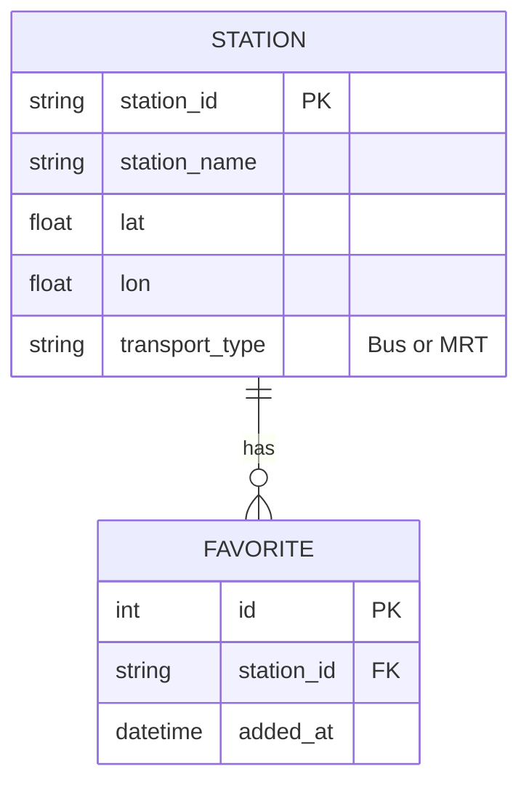

# 資料庫設計文件 (DB DESIGN)

## 1. ER 圖 (實體關係圖)


## 2. 資料表詳細說明
### STATION (站點快取表)
儲存從 TDX 取得的站點基礎資訊，避免重複請求。
- `station_id`: 站點唯一識別碼 (PK)
- `station_name`: 站點名稱
- `lat`: 緯度
- `lon`: 經度
- `transport_type`: 運具類型 (Bus/MRT)

### FAVORITE (使用者收藏)
儲存使用者收藏的站點。
- `id`: 自動遞增 ID (PK)
- `station_id`: 關聯至 STATION (FK)
- `added_at`: 收藏時間

## 3. SQL 建表語法 (database/schema.sql)
```sql
CREATE TABLE IF NOT EXISTS stations (
    station_id TEXT PRIMARY KEY,
    station_name TEXT NOT NULL,
    lat REAL NOT NULL,
    lon REAL NOT NULL,
    transport_type TEXT NOT NULL
);

CREATE TABLE IF NOT EXISTS favorites (
    id INTEGER PRIMARY KEY AUTOINCREMENT,
    station_id TEXT NOT NULL,
    added_at DATETIME DEFAULT CURRENT_TIMESTAMP,
    FOREIGN KEY (station_id) REFERENCES stations (station_id)
);
```
