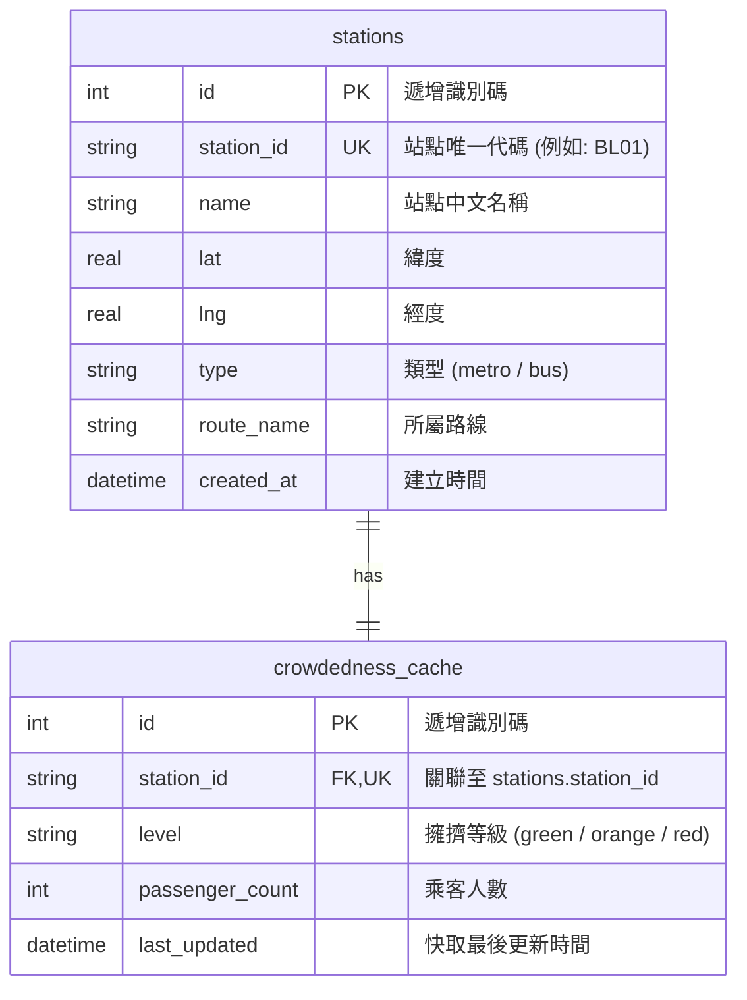
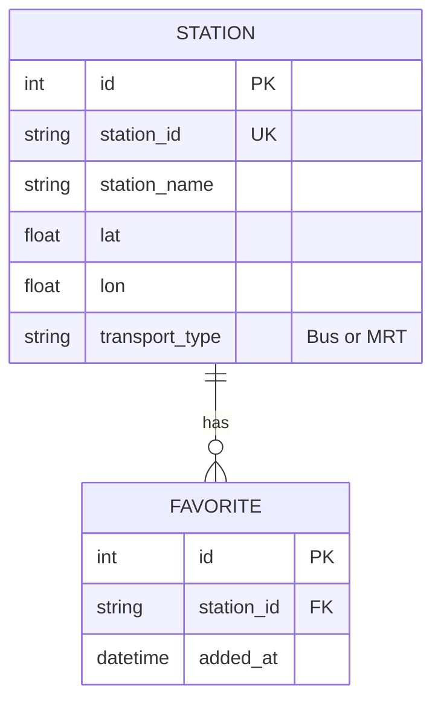

# 資料庫設計與 Model 程式碼說明文件 (DB_DESIGN.md)

本文件根據 [PRD.md](file:///c:/Users/User/create-app/docs/PRD.md)、[ARCHITECTURE.md](file:///c:/Users/User/create-app/docs/ARCHITECTURE.md) 與 [FLOWCHART.md](file:///c:/Users/User/create-app/docs/FLOWCHART.md)，詳細規劃本專案的資料庫 Schema 與 Python Model 的實作內容。

---

## 1. 實體關係圖 (ER Diagram)

系統中主要包含兩個實體：**站點基本資料 (`stations`)** 以及 **即時擁擠度快取 (`crowdedness_cache`)**。這兩個實體存在 **1對1 (One-to-One)** 的外鍵關聯。



---

## 2. 資料表詳細欄位說明

### A. 站點基本資料表 (`stations`)
儲存台中大眾運輸（捷運與公車）的靜態站點資料，包括其名稱、位置經緯度及所屬路線。

| 欄位名稱 (Column) | 資料型別 (Type) | 鍵值屬性 (Key) | 必填 (Null) | 預設值 (Default) | 說明 (Description) |
| :--- | :--- | :--- | :--- | :--- | :--- |
| `id` | `INTEGER` | `PK` | `NOT NULL` | *AUTOINCREMENT* | 本地記錄遞增唯一 ID |
| `station_id` | `TEXT` | `UNIQUE` | `NOT NULL` | *None* | 來自 TDX API 的站點唯一編號，如捷運的 `BL01` 或公車的 `300_1` |
| `name` | `TEXT` | - | `NOT NULL` | *None* | 站點中文名稱，如 `市政府站` |
| `lat` | `REAL` | - | `NOT NULL` | *None* | 站點的 GPS 緯度 (Latitude) |
| `lng` | `REAL` | - | `NOT NULL` | *None* | 站點的 GPS 經度 (Longitude) |
| `type` | `TEXT` | - | `NOT NULL` | *None* | 站點類型，限定為 `'metro'` (捷運) 或 `'bus'` (公車) |
| `route_name` | `TEXT` | - | `NOT NULL` | *None* | 所屬主要路線名稱，如 `捷運綠線`、`300路公車` |
| `created_at` | `TEXT` | - | `NULL` | `datetime('now', 'localtime')` | 站點建立時間 (ISO 格式) |

---

### B. 擁擠度資料快取表 (`crowdedness_cache`)
為了避免頻繁呼叫外部 TDX API，系統將快取最新抓取的擁擠度資料，並記錄更新時間以便判斷快取是否過期（快取有效期為 1 分鐘）。

| 欄位名稱 (Column) | 資料型別 (Type) | 鍵值屬性 (Key) | 必填 (Null) | 預設值 (Default) | 說明 (Description) |
| :--- | :--- | :--- | :--- | :--- | :--- |
| `id` | `INTEGER` | `PK` | `NOT NULL` | *AUTOINCREMENT* | 本地記錄遞增唯一 ID |
| `station_id` | `TEXT` | `FK, UNIQUE` | `NOT NULL` | *None* | 外鍵，參考 `stations(station_id)`。啟用級聯刪除 (`ON DELETE CASCADE`) |
| `level` | `TEXT` | - | `NOT NULL` | *None* | 擁擠度指標，限 `'green'` (通暢)、`'orange'` (普通)、`'red'` (擁擠) |
| `passenger_count` | `INTEGER` | - | `NULL` | `0` | 即時載客或乘客人數 |
| `last_updated` | `TEXT` | - | `NOT NULL` | *None* | 資料最後抓取更新的 ISO 8601 時間，用以檢查快取是否過期 |

---

## 3. SQL 建表語法 (Schema)

完整的 SQLite 建表 SQL 語法儲存於 [database/schema.sql](file:///c:/Users/User/create-app/database/schema.sql) 中，內容如下：

```sql
-- 啟用外鍵約束
PRAGMA foreign_keys = ON;

-- 1. 站點基本資料表 (stations)
CREATE TABLE IF NOT EXISTS stations (
    id INTEGER PRIMARY KEY AUTOINCREMENT,
    station_id TEXT UNIQUE NOT NULL,
    name TEXT NOT NULL,
    lat REAL NOT NULL,
    lng REAL NOT NULL,
    type TEXT NOT NULL CHECK(type IN ('metro', 'bus')),
    route_name TEXT NOT NULL,
    created_at TEXT DEFAULT (datetime('now', 'localtime'))
);

-- 2. 擁擠度資料快取表 (crowdedness_cache)
CREATE TABLE IF NOT EXISTS crowdedness_cache (
    id INTEGER PRIMARY KEY AUTOINCREMENT,
    station_id TEXT UNIQUE NOT NULL,
    level TEXT NOT NULL CHECK(level IN ('green', 'orange', 'red')),
    passenger_count INTEGER DEFAULT 0,
    last_updated TEXT NOT NULL,
    FOREIGN KEY(station_id) REFERENCES stations(station_id) ON DELETE CASCADE
);

-- 建立索引以提升搜尋與地理位置篩選的效能
CREATE INDEX IF NOT EXISTS idx_stations_type ON stations(type);
CREATE INDEX IF NOT EXISTS idx_stations_route ON stations(route_name);
CREATE INDEX IF NOT EXISTS idx_stations_coords ON stations(lat, lng);
```

---

## 4. Python Model 實作

對應的 Python Model 程式碼已在專案中建立，包含以下兩個實體：

### A. 檔案結構
```text
app/
└── models/
    ├── __init__.py           # 套件匯出與初始化
    └── station.py            # 站點及快取之 sqlite3 資料存取邏輯 (含 CRUD)
```

### B. 模型方法摘要說明

在 `app/models/station.py` 中，我們封裝了強健且符合專案特性的資料存取機制：

#### 1. 資料庫連線與自動初始化 (`get_db_connection`)
- 每次開啟連線皆設定 `PRAGMA foreign_keys = ON;`，確保 `ON DELETE CASCADE` 運作正常。
- 自動建立儲存資料庫檔案的 `instance/` 目錄。
- **亮點機制**：若資料表不存在，會自動讀取 [database/schema.sql](file:///c:/Users/User/create-app/database/schema.sql) 進行結構建立，確保環境一鍵執行。

#### 2. `Station` 模型方法 (CRUD)
- `create(station_id, name, lat, lng, type, route_name)`: 新增捷運或公車站點。
- `get_by_id(station_id)`: 查詢特定站點的基本資訊。
- `get_all()`: 取得全部站點清單。
- `get_all_with_crowdedness()`: 透過 `LEFT JOIN` 同步查詢站點基本資訊及其在 `crowdedness_cache` 的擁擠度快取狀態，若無快取則預設為 `'green'`。
- `get_nearby(user_lat, user_lng, limit)`: 根據使用者的 GPS 經緯度定位計算歐幾里得距離，從小排到大回傳最接近的數個站點（對應 **PRD 功能 5**）。
- `update(station_id, ...)`: 動態條件式更新站點名稱、座標、所屬路線等欄位。
- `delete(station_id)`: 刪除站點，因外鍵連動會自動刪除關聯的快取。

#### 3. `CrowdednessCache` 模型方法 (快取更新與驗證)
- `create_or_update(station_id, level, passenger_count, last_updated)`: 使用 SQLite 的 `UPSERT` 語法，如果快取已存在則直接更新等級、人數與時間戳，不存在則新增。
- `get_by_station_id(station_id)`: 查詢單一站點的最新快取。
- `is_cache_valid(station_id, cache_duration_seconds)`: 驗證指定站點的快取是否依然在時效內（預設 60 秒），做為 **ARCHITECTURE.md** 中快取命中與否的核心判斷依據。
- `delete(station_id)`: 手動刪除某站的快取資料。

> [!IMPORTANT]
> 所有的資料模型皆採用物件導向（OOD）封裝，回傳標準的 `Station` 與 `CrowdednessCache` Python 類別實例。這能讓 Route 層免於直接與底層 SQL Row 鍵值互動，大幅提高 Controller（Flask Route）程式碼的可讀性與可維護性。
# 資料庫設計文件 (DB DESIGN)

## 1. ER 圖 (實體關係圖)


## 2. 資料表詳細說明
### STATION (站點快取表)
儲存從 TDX 取得的站點裝修資訊，避免重複請求。
- `id`: 自動遞增 ID (PK)
- `station_id`: 站點唯一識別碼 (UK)
- `station_name`: 站點名稱
- `lat`: 緯度
- `lon`: 經度
- `transport_type`: 運具類型 (Bus/MRT)

### FAVORITE (使用者收藏)
儲存使用者收藏的站點。
- `id`: 自動遞增 ID (PK)
- `station_id`: 關聯至 STATION (FK)
- `added_at`: 收藏時間

## 3. SQL 建表語法 (database/schema.sql)
```sql
CREATE TABLE IF NOT EXISTS stations (
    id INTEGER PRIMARY KEY AUTOINCREMENT,
    station_id TEXT UNIQUE NOT NULL,
    station_name TEXT NOT NULL,
    lat REAL NOT NULL,
    lon REAL NOT NULL,
    transport_type TEXT NOT NULL
);

CREATE TABLE IF NOT EXISTS favorites (
    id INTEGER PRIMARY KEY AUTOINCREMENT,
    station_id TEXT NOT NULL,
    added_at DATETIME DEFAULT CURRENT_TIMESTAMP,
    FOREIGN KEY (station_id) REFERENCES stations (station_id)
);
```
