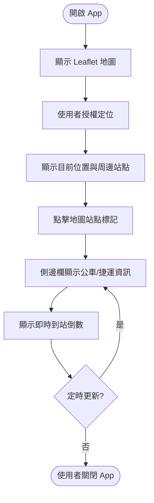
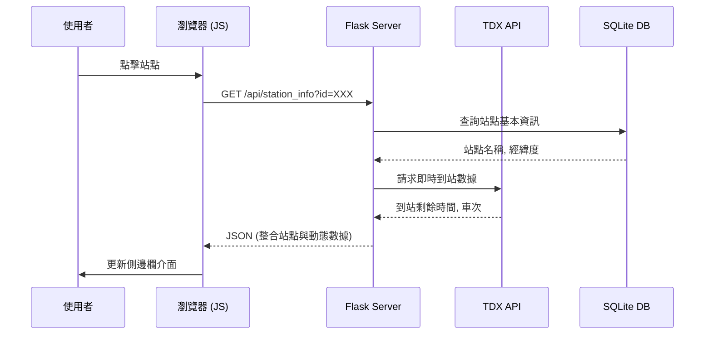

# 系統流程圖 (FLOWCHART)

## 1. 使用者操作流程

```mermaid
graph TD
    Start([開啟 App]) --> Map[顯示 Leaflet 地圖]
    Map --> Loc[使用者授權定位]
    Loc --> ShowPos[顯示目前位置與周邊站點]
    ShowPos --> ClickMarker[點擊地圖站點標記]
    ClickMarker --> Sidebar[側邊欄顯示公車/捷運資訊]
    Sidebar --> RealTime[顯示即時到站倒數]
    RealTime --> Refresh{定時更新?}
    Refresh -- 是 --> Sidebar
    Refresh -- 否 --> End([使用者關閉 App])
```

## 2. 資料處理流程

```mermaid
sequenceDiagram
    participant User as 使用者
    participant Browser as 瀏覽器 (JS)
    participant Flask as Flask Server
    participant TDX as TDX API
    participant DB as SQLite DB

    User->>Browser: 點擊站點
    Browser->>Flask: GET /api/station_info?id=XXX
    Flask->>DB: 查詢站點基本資訊
    DB-->>Flask: 站點名稱, 經緯度
    Flask->>TDX: 請求即時到站數據
    TDX-->>Flask: 到站剩餘時間, 車次
    Flask-->>Browser: JSON (整合站點與動態數據)
    Browser->>User: 更新側邊欄介面
```
