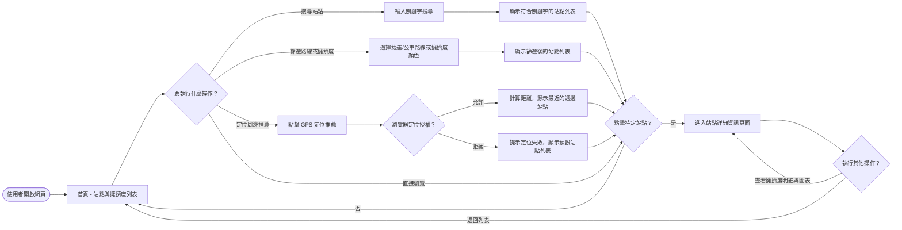
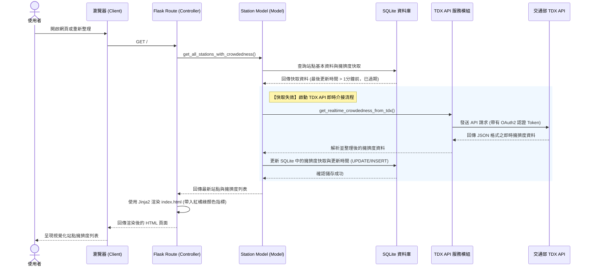
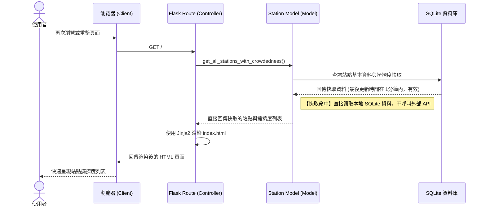
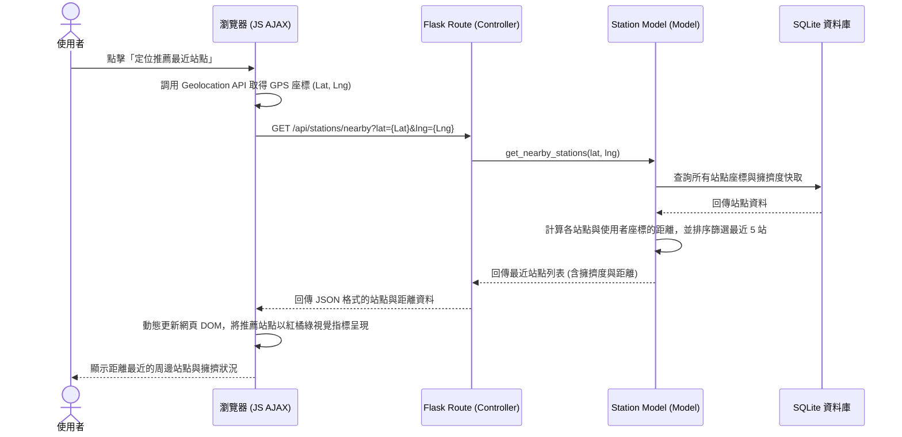

# 系統流程圖與使用者流程圖文件 (FLOWCHART.md)

本文件根據 [PRD.md](file:///c:/Users/User/create-app/docs/PRD.md) 與 [ARCHITECTURE.md](file:///c:/Users/User/create-app/docs/ARCHITECTURE.md) 設計，詳細規劃了**台中大眾運輸站點狀態與擁擠度顯示系統**的「使用者操作流程」、「系統資料流序列圖」以及「後端 API/路由功能對照表」。

透過這些圖表，可以清晰地視覺化使用者與系統各個元件（包括 Flask Route、SQLite 資料庫與外部 TDX API）的互動模式。

---

## 1. 使用者流程圖 (User Flow)

此流程圖描述使用者從進入系統首頁開始，如何透過搜尋、篩選或定位功能來查詢台中大眾運輸站點的擁擠度，並查看站點的詳細資訊。

> [!NOTE]
> 首頁的核心設計為「直觀的紅橘綠三色擁擠度指標」，讓使用者在進入首頁或進行篩選時，能在 1 秒內透過視覺顏色判斷各站點的人潮擁擠程度，有效提升通勤決策效率。

---

## 2. 系統序列圖 (Sequence Diagram)

為了解決外部 **TDX API** 呼叫限制並提升前端響應速度，系統實作了 SQLite 資料庫快取機制。以下分別說明「快取失效 (Cache Miss)」與「快取命中 (Cache Hit)」兩種情境，以及「前端 GPS 定位推薦」的系統資料流。

### 情境一：載入首頁且快取失效時 (Cache Miss)
當使用者載入頁面，且資料庫中的快取資料已過期（例如超過 1 分鐘），系統將主動呼叫 TDX API 並更新快取。

---

### 情境二：載入首頁且快取命中時 (Cache Hit)
當使用者在快取有效期內（例如 1 分鐘內）重複瀏覽，系統直接從 SQLite 讀取快取資料，不呼叫外部 API。

---

### 情境三：使用者啟用 GPS 定位推薦周邊站點
當使用者點擊「定位推薦」，前端透過 Geolocation API 獲取座標，並以 AJAX 方式請求後端 API，計算距離後即時更新頁面。

---

## 3. 功能清單對照表

本系統規定的功能、URL 路由、HTTP 方法及對應的架構元件對照如下：

| 功能名稱 | URL 路徑 | HTTP 方法 | 負責的模組 / 邏輯元件 | 說明 |
| :--- | :--- | :--- | :--- | :--- |
| **首頁（站點與擁擠度列表）** | `/` | `GET` | `app/routes/views.py` (Controller) `app/models/station.py` (Model) `app/templates/index.html` (View) | 顯示台中捷運/公車的站點列表，依照即時擁擠度渲染紅、橘、綠三色指標。支援搜尋及路線篩選。 |
| **站點詳細資訊頁面** | `/station/<station_id>` | `GET` | `app/routes/views.py` (Controller) `app/models/station.py` (Model) `app/templates/detail.html` (View) | 顯示特定站點的詳細資訊、即時人潮細節、車廂載客分配或下一班車擁擠狀況。 |
| **取得定位周邊站點 (API)** | `/api/stations/nearby` | `GET` | `app/routes/views.py` (Controller) `app/models/station.py` (Model) | 接收前端經緯度參數 (`lat`, `lng`)，計算距離並以 JSON 回傳距離最近的數個站點及擁擠度資料。 |
| **手動/系統更新快取 (API)** | `/api/stations/refresh` | `POST` | `app/routes/views.py` (Controller) `app/services/tdx_api.py` (Service) | 提供前端手動重新整理或系統排程觸發，強制向 TDX API 重新請求最新擁擠度並寫入資料庫快取。 |

> [!TIP]
> **API 金鑰與防護考量**：
> 所有的外部 API 呼叫（如 `/api/stations/refresh`）後端程式碼均透過 `app/services/tdx_api.py` 來安全管理 `Client ID` 和 `Client Secret`（讀取自 `.env`），避免將敏感金鑰暴露在前端 JS 程式碼中。
