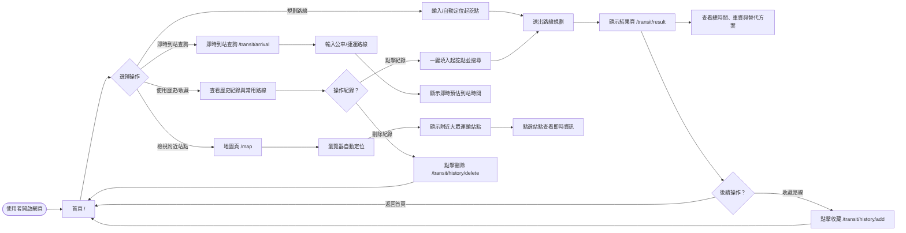
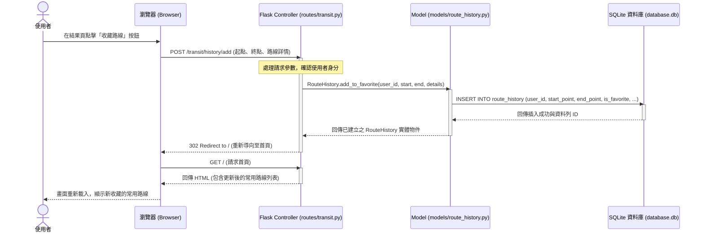

# 流程圖設計 (Flowchart) - 台中大眾運輸交通整合APP系統

本文件根據 [PRD.md](file:///c:/Users/User/Desktop/create-app/docs/PRD.md) 的功能需求與 [ARCHITECTURE.md](file:///c:/Users/User/Desktop/create-app/docs/ARCHITECTURE.md) 的系統架構設計，繪製本系統的**使用者流程圖（User Flow）**與**系統序列圖（Sequence Diagram）**，並提供**功能清單對照表**。

---

## 1. 使用者流程圖 (User Flow)

此流程圖描述使用者從開啟網頁開始，操作各項主要功能（包括定位、路線規劃、地圖檢視、即時到站查詢、新增與刪除收藏）的操作路徑。

---

## 2. 系統序列圖 (Sequence Diagram)

此圖描述「使用者點擊收藏路線（新增功能）」到「資料存入 SQLite 資料庫」的完整交互流程，涵蓋瀏覽器、Flask Route、Model 與資料庫。

---

## 3. 功能清單對照表

| 功能模組 | 功能描述 | URL 路徑 | HTTP 方法 | 對應後端檔案與 View |
| :--- | :--- | :--- | :--- | :--- |
| **首頁模組 (Main)** | 顯示搜尋表單與歷史/收藏列表 | `/` | `GET` | [main.py](file:///c:/Users/User/Desktop/create-app/app/routes/main.py)  渲染 `index.html` |
| **地圖模組 (Main)** | 大眾運輸檢視圖 (地圖頁面) | `/map` | `GET` | [main.py](file:///c:/Users/User/Desktop/create-app/app/routes/main.py)  渲染 `map.html` |
| **交通核心 (Transit)** | 執行起訖點路線規劃搜尋 | `/transit/search` | `POST` | [transit.py](file:///c:/Users/User/Desktop/create-app/app/routes/transit.py)  呼叫外部 API 並處理邏輯 |
| **交通核心 (Transit)** | 顯示路線規劃與時間預估結果 | `/transit/result` | `GET` | [transit.py](file:///c:/Users/User/Desktop/create-app/app/routes/transit.py)  渲染 `result.html` |
| **交通核心 (Transit)** | 即時到站時間查詢 | `/transit/arrival` | `GET` | [transit.py](file:///c:/Users/User/Desktop/create-app/app/routes/transit.py)  取得特定公車/捷運即時到站資訊 |
| **歷史與收藏 (History)** | 新增常用路線/收藏 | `/transit/history/add` | `POST` | [transit.py](file:///c:/Users/User/Desktop/create-app/app/routes/transit.py)  呼叫 [route_history.py](file:///c:/Users/User/Desktop/create-app/app/models/route_history.py) 寫入 |
| **歷史與收藏 (History)** | 刪除歷史紀錄或常用路線 | `/transit/history/delete/<int:id>` | `POST` | [transit.py](file:///c:/Users/User/Desktop/create-app/app/routes/transit.py)  呼叫 [route_history.py](file:///c:/Users/User/Desktop/create-app/app/models/route_history.py) 移除 |
