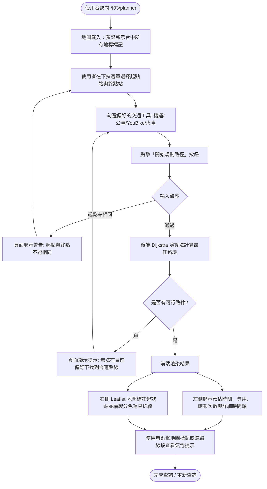
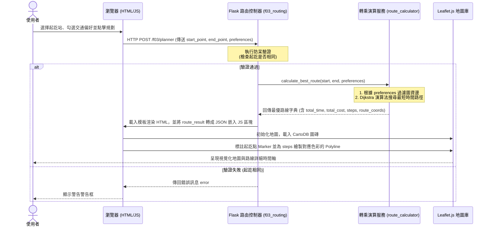

# 流程圖設計文件 (Flowcharts & Sequence Diagrams)

本文件使用 Mermaid 語法來繪製「台中大眾運輸交通整合APP」F-03 轉乘規劃模組的操作流程與資料流。

## 一、使用者流程圖 (User Flow)

這個流程圖描述使用者在網頁上的操作路徑：

---

## 二、系統序列圖 (Sequence Diagram)

這張序列圖描述當使用者提交查詢時，資料如何在瀏覽器、Flask 路由控制、Dijkstra 演算法服務與地圖渲染庫之間傳遞：

---

## 三、功能清單與對照表

以下為 F-03 模組規劃之 URL 路由與 HTTP 動作對照：

| 功能編號 | 功能名稱 | URL 路徑 | HTTP 方法 | 後端處理函式 | 前端對應視圖 / 模板 |
| --- | --- | --- | --- | --- | --- |
| **F-03** | 跨運具轉乘首頁與地標檢視 | `/f03/planner` | **GET** | `route_planner()` | `f03/route_planner.html` (地圖初始呈現) |
| **F-03** | 執行轉乘路徑演算與繪圖 | `/f03/planner` | **POST** | `route_planner()` | `f03/route_planner.html` (地圖繪製折線與時間軸) |
